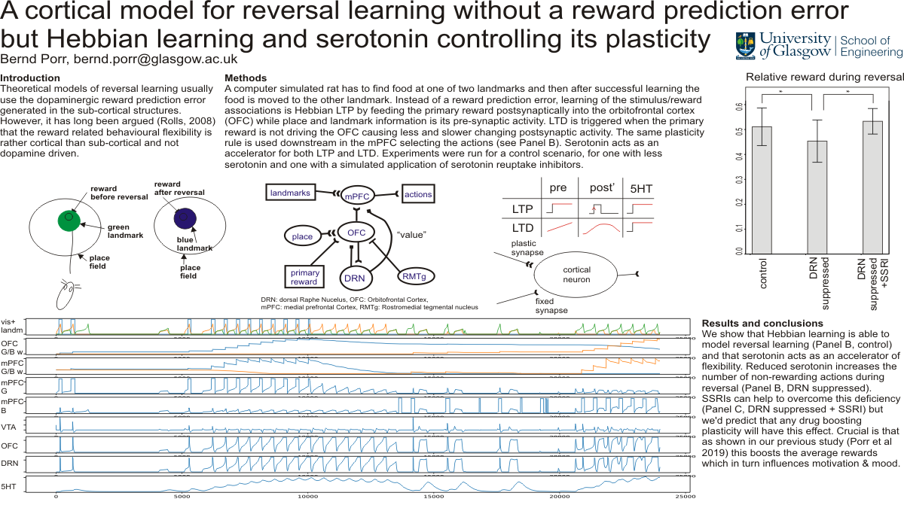

## Behaviour based simulator

### Stimuli

 * Visual landmark (dark green and bright green objects)
 * Place fields around them
 * Reward signal at the landmark which can be assigned to one of the landmarks
 * Switching of the reward from one landmark to the other (reversal)
 * Reward delivery can be delayed for delayed reward paradigms

### Motor output
 * Two signals to either approach the dark green landmark or the bright one

### Requires
 * QT5

### Compile under Linux
 * Install the other packages: "apt-get install qt5-qmake, g++, qtbase5-dev-tools, qtdeclarative5-dev-tools, qtbase5-dev, qt5-default"
 * qmake
 * make

### How to run?

There are two different modes: single run (-a) and statistical run (-b).

The option -p selects the different scenarios (see below) which cause a lack of
5HT and different options to fix it. With the -p option subdirectories are
created according to the scenario.

```
./patience-5ht: command line options
 -a:            single food run
 -b:            statistics
 -f max:        max contacts to the landmark with food for stats
 -q:            quicktime export
 -n:            no graphical output
 -p scenario #: experimental scenario
Possible scenarios:
0 : Normal condition (/normal/)
1 : Reward shows up earlier (/normal_less_wait/)
2 : DRN is suppressed (/drn_suppress/)
3 : DRN is suppressed and less wait (/drn_suppress_less_wait/)
4 : DRN is suppressed and SSRI (/drn_suppress_ssri/)
5 : DRN is suppressed, SSRI and less wait (/drn_suppress_ssri_less_wait/)
6 : DRN is suppressed and 5HTR2 up (/drn_suppress_5ht2up/)
7 : DRN is suppressed, 5HTR2 up and less wait (/drn_suppress_5ht2up_less_wait/)
```

Do run stats of all scenarios type:
```run_all_stats.sh``` and then plot the results with
```normalised_reward.py```.
